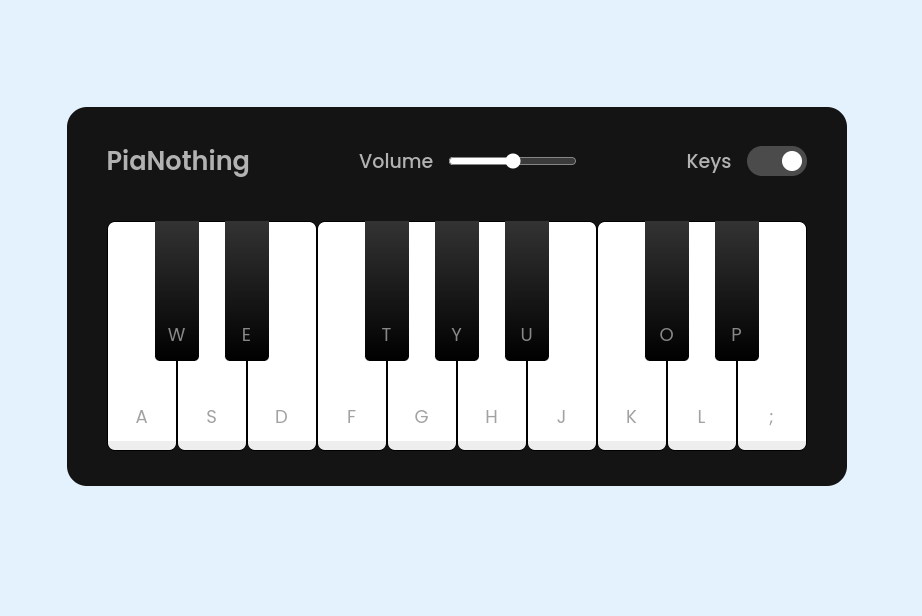

<h1 align="center"> Useless Playable Piano </h1>

<h3 align="center">
  <a href="https://useless-piano.vercel.app">Acesse Meu App</a>
</h3>

  

## 🚀 Tecnologias

Esse projeto foi desenvolvido com as seguintes tecnologias:

- Javascript
- HTML & CSS
- Git & GitHub

## 💻 Projeto

Criar um piano tocável para treino.
